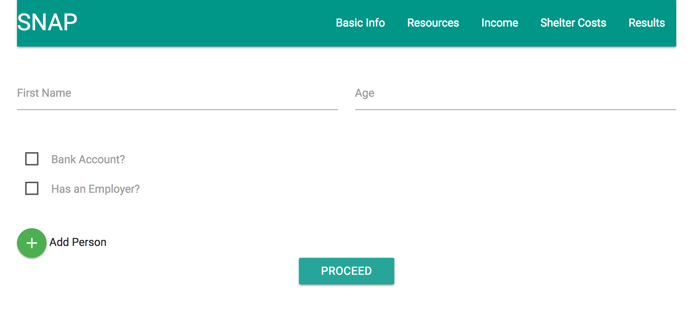
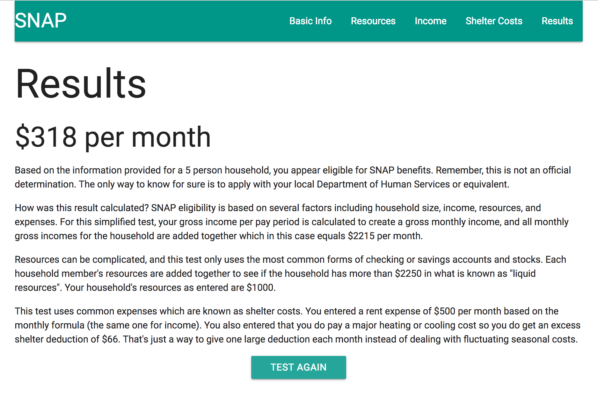

# SNAP-Determination-Capstone

Overview of app: An app to determine eligibility for SNAP benefits and provide anonymous eligibility data via API using Angular, MongoDB/Mongoose, Express, Materialize, and Node.

Users initially view some information about the app on the home screen, and enter a zip code to begin.  This creates a household id in mongo and an ng-cookie in Angular which is used to tie the individual information together during the process.

The following prompts users to construct their household by adding persons and declaring which household members have resources or employers.

Those persons with resources are prompted on the following page to enter their total account balance.

Those persons who have employers are prompted on the following page to enter their employer name, pay frequency, and 8 weeks of pay amounts.

The next page allows users to enter shelter costs which can be used as deductions to increase benefit amount.

The final page offers a summary of eligibility.

